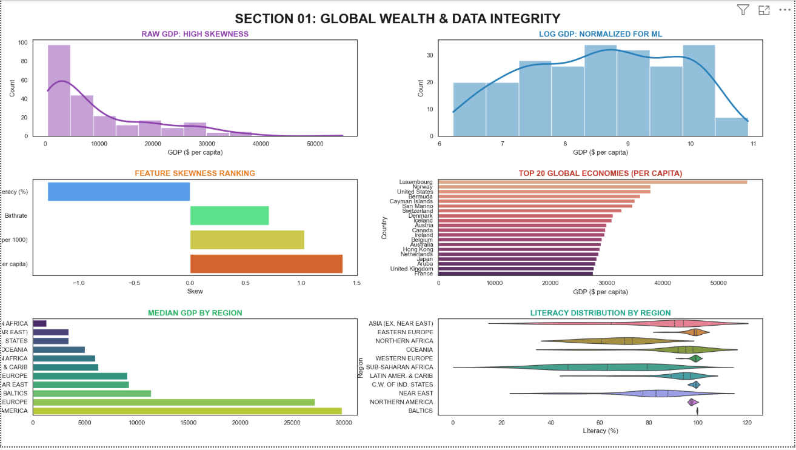
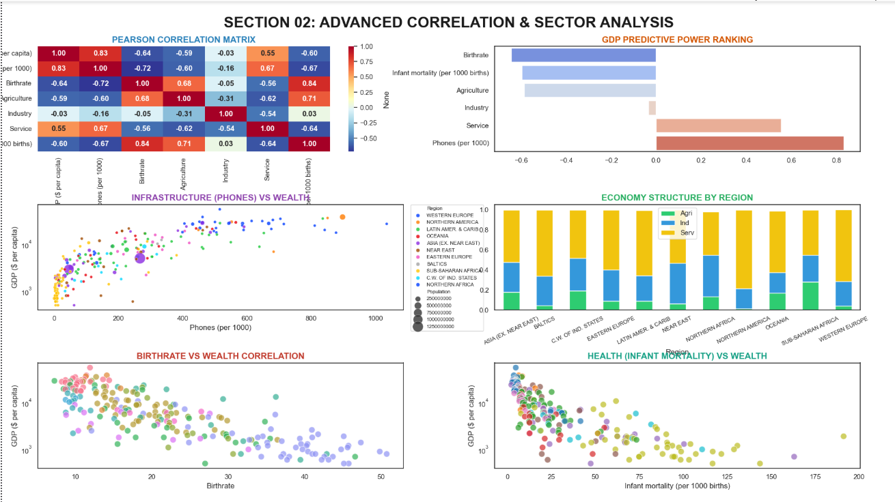
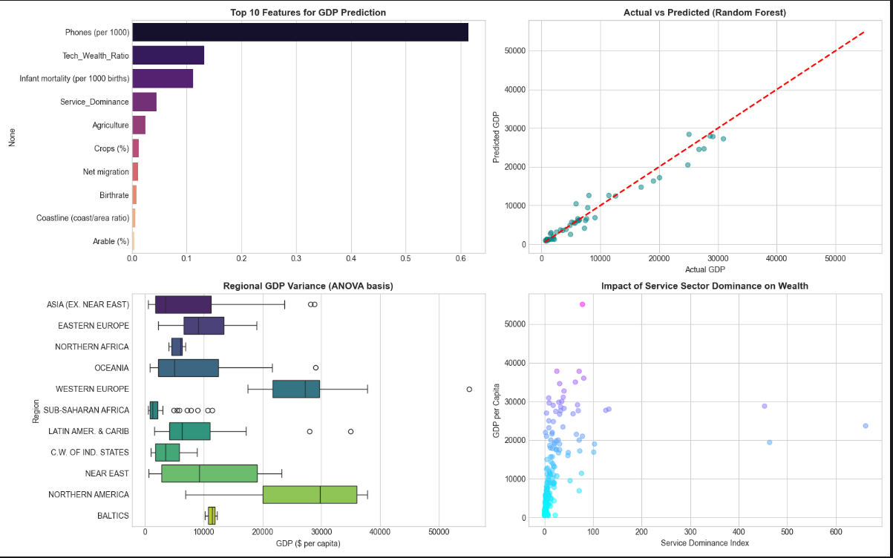

<div align="center">

# Global GDP Analysis: Socio-Economic Drivers of National Wealth

A complete data science workflow from data engineering and statistical testing to machine learning and a Power BI dashboard.

<br/>

<!-- Tech icons row -->
<p>
  
</p>

<!-- Badge row (includes Power BI + data/ML stack) -->
<p>
  
  
  
  
  
  
  
</p>

</div>

---

## Overview

This project investigates why some nations are wealthier than others by analyzing a dataset of 227 countries with 20 socio-economic features spanning demographics, infrastructure, and sector composition. The workflow combines rigorous cleaning, statistical validation, feature engineering, predictive modeling, and interactive reporting.

---

## Pipeline Summary

### 1) Data Engineering and Integrity
- Dataset: 227 countries with 20 socio-economic indicators
- Regional median imputation for missing values (geography-aware cleaning)
- Data scrubbing: numeric parsing, decimal-comma fixes, whitespace cleanup

### 2) Exploratory Analysis and Statistical Awareness
- Identified strong right-skew in GDP per Capita
- Applied log1p transformation to stabilize the target for modeling
- Outlier profiling using Z-score and IQR

### 3) Feature Engineering
Engineered efficiency-style features to capture deeper economic structure:
- Tech-to-Wealth Ratio
- Industry Efficiency
- Service Dominance Index

### 4) Statistical Testing
- Shapiro-Wilk test to validate distribution assumptions and transformation impact
- One-way ANOVA to test whether regional differences are statistically significant (p < 0.05)

### 5) Predictive Modeling
Compared:
- Linear Regression (baseline)
- Random Forest Regressor (non-linear ensemble)

Metrics:
- RMSE
- MAE

Also includes feature importance analysis for interpretability.

### 6) Power BI Dashboard
A 2-page Power BI dashboard presenting:
- global maps and ranking views
- distribution and skew analysis
- correlation heatmaps
- sector composition analysis
- log-scale relationship plots
- Python visuals (Matplotlib/Seaborn) embedded where needed

---

## Results and Visual Outputs

### Section 01: Global Wealth and Data Integrity


### Section 02: Advanced Correlation and Sector Analysis


### Model and Statistical Results


---

## Repository Structure

- `countries of the world.csv` - source dataset
- `mtech_advanced.py` - main Python pipeline (cleaning, EDA, stats, feature engineering, ML)
- `export_for_powerbi.py` - export script for BI-ready dataset
- `powerbi_data.csv` - curated dataset used by Power BI
- `data analysis.pbix` - Power BI dashboard file

---

## How to Run

Run the core analysis:
```bash
python mtech_advanced.py
```

Export dataset for Power BI:
```bash
python export_for_powerbi.py
```

Open the dashboard:
- Open `data analysis.pbix` in Power BI Desktop

---

